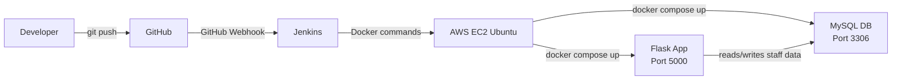

# Hospital Staff Management — Two-Tier Docker & Jenkins CI/CD Automation


This project is a beginner-friendly DevOps portfolio project that shows how a simple Python Flask application can be deployed using Docker, Docker Compose, MySQL, and Jenkins on an AWS EC2 Ubuntu server. It focuses on practical learning and hands-on deployment rather than enterprise-scale architecture.

The application is a basic hospital staff management system with CRUD operations for staff records. It also exposes a health endpoint to verify that the Flask app can connect to the MySQL database.

## Table of Contents

- [Project Overview](#project-overview)
- [Application Features](#application-features)
- [Two-Tier Architecture](#two-tier-architecture)
- [CI/CD Flow](#cicd-flow)
- [Technology Stack](#technology-stack)
- [Project Structure](#project-structure)
- [Setup Instructions](#setup-instructions)
- [Docker and Compose](#docker-and-compose)
- [Jenkins Setup](#jenkins-setup)
- [GitHub Webhook Integration](#github-webhook-integration)
- [Verification](#verification)
- [Troubleshooting](#troubleshooting)
- [What I Learned](#what-i-learned)
- [Project Highlights](#project-highlights)
- [Screenshots](#screenshots)
- [Future Improvements](#future-improvements)
- [How I Would Explain This Project in an Interview](#how-i-would-explain-this-project-in-an-interview)
- [Resume / Portfolio Description](#resume--portfolio-description)
- [Author](#author)

## Project Overview

This repository is a small but practical DevOps project for learning real-world deployment workflows. The main goal is to show how code can move from GitHub to Jenkins and then to Docker containers running on an AWS EC2 machine.

It includes:

- A Python Flask web application
- A MySQL database in a separate container
- Dockerization using a Dockerfile
- Multi-container orchestration using Docker Compose
- Jenkins pipeline automation
- Health check verification for deployment success
- GitHub Webhook-based triggering

This is a fresher-level project designed to help explain DevOps concepts clearly in interviews and projects.

## Application Features

The application manages hospital staff information and supports the following functions:

- Add staff details
- View all staff records
- Edit existing staff details
- Delete staff records
- Check application health via the `/health` endpoint

Staff records include:

- Name
- Role
- Department
- Email
- Phone

The health endpoint is implemented in the Flask app and returns a JSON response when the application can connect to MySQL:

```json
{
  "status": "healthy",
  "database": "connected"
}
```

## Two-Tier Architecture

This project uses a simple two-tier application design:

- Tier 1: Flask web application
- Tier 2: MySQL database

Docker Compose manages both services and keeps them connected through the internal Docker network.



### What each layer does

- Flask app: handles user requests and serves HTML pages
- MySQL: stores hospital staff records
- Docker Compose: starts and connects both containers

The CI/CD flow is simple and beginner-friendly. A developer pushes code to GitHub, GitHub notifies Jenkins through a webhook, and Jenkins builds and deploys the containers on the EC2 server.

## CI/CD Flow

The actual workflow implemented in this project is:

```text
Developer
    |
    | git push
    v
GitHub
    |
    | GitHub Webhook
    v
Jenkins
    |
    +--> Checkout source code
    |
    +--> Build Docker image
    |
    +--> Stop existing containers
    |
    +--> Deploy containers using Docker Compose
    |
    +--> Wait for application to start
    |
    +--> Verify deployment with health check
    v
Deployment successful
```

This project uses Jenkins as the automation tool. When a push is made to the main branch, a GitHub webhook triggers the Jenkins pipeline automatically. Jenkins then runs the required Docker steps to deploy the application on the EC2 server.

## Technology Stack

| Category | Technologies |
| --- | --- |
| Application | Python, Flask, HTML/CSS, MySQL |
| DevOps | Git, GitHub, Docker, Docker Compose, Jenkins, GitHub Webhooks |
| Cloud / OS | AWS EC2, Ubuntu Linux |

## Project Structure

The repository structure is as follows:

```text
Two-Tier-Docker-Jenkins-CICD-Automation/
├── app.py
├── requirements.txt
├── Dockerfile
├── docker-compose.yml
├── init.sql
├── Jenkinsfile
├── .dockerignore
├── .gitignore
├── LICENSE
├── README.md
└── templates/
    ├── add_staff.html
    ├── edit_staff.html
    └── index.html
```

## Setup Instructions

Follow these steps to run the project locally.

### 1. Clone the repository

```bash
git clone https://github.com/karanbari426/Two-Tier-Docker-Jenkins-CICD-Automation.git
```

### 2. Enter the project directory

```bash
cd Two-Tier-Docker-Jenkins-CICD-Automation
```

### 3. Build Docker images

```bash
docker compose build
```

### 4. Start the containers

```bash
docker compose up -d
```

### 5. Check running containers

```bash
docker compose ps
```

### 6. View container logs

```bash
docker compose logs
```

### 7. Check the application health

```bash
curl http://localhost:5000/health
```

### 8. Open the application in a browser

```text
http://SERVER_IP:5000
```

If you are running the app locally, use `http://localhost:5000`.

## Docker and Compose

Docker is used to containerize the Python Flask application. Docker Compose is used to manage the application and database containers together.

The project defines two main services in `docker-compose.yml`:

1. `app` — Flask application container
2. `db` — MySQL database container

### Important details from the project

- Flask container exposes port `5000`
- MySQL container runs inside the Docker network and is not exposed for public access in the app design
- Database data is stored with a Docker volume named `mysql_data`
- The MySQL service has a health check so the app waits until the database is ready

Why Docker Compose is useful in this project:

- It runs multiple containers together
- It sets up environment variables automatically
- It keeps app and database startup simple
- It makes deployment and testing easier for a beginner project

## Jenkins Setup

Jenkins is installed on an AWS EC2 Ubuntu machine in this project setup.

Jenkins is used to:

- access the GitHub repository
- read the `Jenkinsfile` from the repository
- build the Docker image
- deploy the containers with Docker Compose
- check the application health using `curl`

### Jenkins pipeline configuration

Use the following job settings in Jenkins:

- Type: `Pipeline`
- Definition: `Pipeline script from SCM`
- SCM: `Git`
- Repository URL: your GitHub repository URL
- Branch: `main`
- Script Path: `Jenkinsfile`

The repository's `Jenkinsfile` contains these stages:

1. Checkout
2. Build Docker Images
3. Stop Existing Containers
4. Deploy Containers
5. Verify Deployment

This is exactly what the project currently implements.

## GitHub Webhook Integration

GitHub Webhooks are used to trigger Jenkins automatically after a code push.

```text
git push
    ↓
GitHub
    ↓
Webhook
    ↓
Jenkins
    ↓
Pipeline
    ↓
Docker deployment
```

The webhook triggers Jenkins when changes are pushed to the main branch. Jenkins then runs the pipeline defined in `Jenkinsfile` and deploys the application using Docker Compose.

A generic webhook endpoint is used in the Jenkins setup, such as:

```text
/github-webhook/
```

No secret values or credentials are included in this repository.

## Verification

After deployment, you can verify whether the application is running correctly.

### Check running containers

```bash
docker ps
```

### Check compose services

```bash
docker compose ps
```

### Check app health

```bash
curl http://localhost:5000/health
```

Expected response:

```json
{
  "status": "healthy",
  "database": "connected"
}
```

A successful health check means the Flask application is running and can communicate with MySQL.

## Troubleshooting

Below are a few beginner-friendly checks you can use if the deployment does not work correctly.

### 1. Docker permission issue

```bash
sudo usermod -aG docker $USER
```

Then log out and log back in.

### 2. Check Docker status

```bash
docker ps
```

### 3. Check Docker Compose version

```bash
docker compose version
```

### 4. Check the Flask app logs

```bash
docker compose logs app
```

### 5. Check the database logs

```bash
docker compose logs db
```

### 6. Check Jenkins status

```bash
sudo systemctl status jenkins
```

### 7. Check application health

```bash
curl http://localhost:5000/health
```

### 8. View all containers

```bash
docker ps -a
```

## What I Learned

This project helped build practical skills in:

- Linux server management
- Git and GitHub workflow
- Python Flask application development
- MySQL database setup
- Docker containerization
- Docker Compose orchestration
- AWS EC2 deployment basics
- Jenkins pipelines
- GitHub Webhooks
- CI/CD automation
- Health checks and debugging
- Basic cloud deployment troubleshooting

This is a realistic fresher-level learning project and a good foundation for DevOps and cloud roles.

## Project Highlights

- Two-tier architecture
- Flask + MySQL application
- Dockerized application
- Docker Compose deployment
- Jenkins CI/CD pipeline
- GitHub Webhook automation
- AWS EC2 deployment
- Automated health check verification

## Screenshots

This repository does not currently contain screenshot files, so screenshots should be added later as part of the project documentation.

Recommended screenshots to add:

1. Hospital Staff Management web app
2. Jenkins successful pipeline run
3. Jenkins console output
4. GitHub repository view
5. GitHub webhook configuration
6. AWS EC2 instance overview
7. Running Docker containers

## Future Improvements

The following ideas are not currently implemented in this repository, but they are good future learning goals:

- Terraform
- Ansible
- AWS ECR
- AWS RDS
- Nginx
- HTTPS
- Prometheus
- Grafana
- SonarQube
- Trivy
- Kubernetes

These are future improvement ideas for learning, not currently available features in this project.

## How I Would Explain This Project in an Interview

I built a simple Hospital Staff Management web application using Python Flask and MySQL. I containerized the application and database using Docker and Docker Compose, and I deployed them on an AWS EC2 Ubuntu server. I also created a Jenkins pipeline that checks out the code, builds the Docker image, deploys the containers, and verifies the app using a health endpoint. I configured GitHub Webhook integration so that a push to the main branch can automatically trigger the deployment process. This project helped me learn how CI/CD works in a practical environment with Git, Docker, Jenkins, and cloud hosting.

## Resume / Portfolio Description

Developed and deployed a two-tier Hospital Staff Management application using Python Flask and MySQL. Containerized the application with Docker and Docker Compose and implemented a Jenkins CI/CD pipeline with GitHub Webhook integration for automated deployment on AWS EC2 Ubuntu.

## Author

### Karan Bari

Aspiring Cloud & DevOps Engineer | Python Developer | Linux | AWS

GitHub: https://github.com/karanbari426

---

This project is intended as a practical learning and portfolio project for freshers who want to understand the basics of Docker, Jenkins, GitHub integration, and cloud deployment in a simple, real-world setup.
