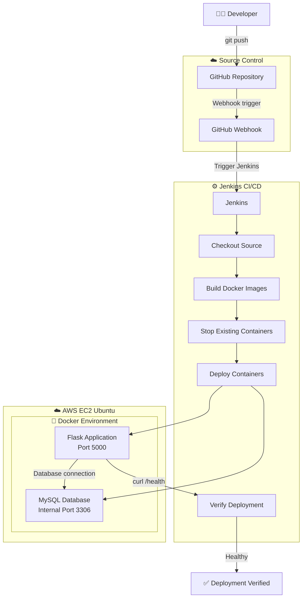
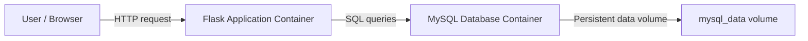

# 🏥 Hospital Staff Management

### Two-Tier Web Application | Docker | Jenkins CI/CD | AWS EC2


A simple DevOps portfolio project that demonstrates how a Python Flask application and MySQL database can be containerized with Docker, deployed on AWS EC2 Ubuntu, and automated with a Jenkins pipeline triggered by GitHub Webhooks.

This project is designed for learning and interview preparation. It focuses on practical deployment basics, container orchestration, CI/CD automation, and health verification without claiming enterprise production complexity.

## Table of Contents

- [Project Overview](#project-overview)
- [Features](#features)
- [Architecture](#architecture)
- [Technology Stack](#technology-stack)
- [Project Structure](#project-structure)
- [Setup Instructions](#setup-instructions)
- [Docker and Docker Compose](#docker-and-docker-compose)
- [Jenkins CI/CD Pipeline](#jenkins-cicd-pipeline)
- [GitHub Webhook Workflow](#github-webhook-workflow)
- [Verification](#verification)
- [Troubleshooting](#troubleshooting)
- [What I Learned](#what-i-learned)
- [Project Highlights](#project-highlights)
- [Screenshots](#screenshots)
- [Future Improvements](#future-improvements)
- [Interview Explanation](#interview-explanation)
- [Resume / Portfolio Description](#resume--portfolio-description)
- [Author](#author)

---

## Project Overview

This repository contains a basic hospital staff management application that allows users to:

- add a staff member
- view all staff records
- edit staff data
- delete staff records

The application is built using Python and Flask, while the data is stored in MySQL. The app is containerized using Docker and deployed with Docker Compose on an AWS EC2 Ubuntu instance. Jenkins is used to automate the deployment flow when code is pushed to GitHub.

### Main purpose of the project

- Learn Linux and server basics
- Understand Git and GitHub workflow
- Containerize a Flask app with Docker
- Run MySQL in a separate container
- Automate deployment with Jenkins
- Trigger automation using GitHub Webhooks
- Practice health checks and basic deployment troubleshooting

---

## Features

The application includes the following features:

- Add hospital staff information
- View staff details in a list
- Edit existing records
- Delete records
- Health check endpoint at `/health`

### Staff fields

- Name
- Role
- Department
- Email
- Phone

### Health endpoint response

```json
{
  "status": "healthy",
  "database": "connected"
}
```

This endpoint confirms that the Flask application can connect to the MySQL database successfully.

---

## Architecture

This project uses a simple two-tier architecture:

- Tier 1: Flask web application
- Tier 2: MySQL database

### DevOps workflow architecture



### Runtime architecture



This runtime flow shows that the Flask app communicates with MySQL through the Docker internal network rather than exposing MySQL publicly.

---

## Technology Stack

| Category | Technologies |
| --- | --- |
| Application | Python, Flask, HTML/CSS, MySQL |
| DevOps | Git, GitHub, Docker, Docker Compose, Jenkins, GitHub Webhooks |
| Cloud / OS | AWS EC2, Ubuntu Linux |

---

## Project Structure

```text
Two-Tier-Docker-Jenkins-CICD-Automation/
├── app.py
├── requirements.txt
├── Dockerfile
├── docker-compose.yml
├── init.sql
├── Jenkinsfile
├── .dockerignore
├── .gitignore
├── LICENSE
├── README.md
└── templates/
    ├── add_staff.html
    ├── edit_staff.html
    └── index.html
```

---

## Setup Instructions

### 1. Clone the repository

```bash
git clone https://github.com/karanbari426/Two-Tier-Docker-Jenkins-CICD-Automation.git
```

### 2. Move into the project directory

```bash
cd Two-Tier-Docker-Jenkins-CICD-Automation
```

### 3. Build the Docker images

```bash
docker compose build
```

### 4. Start the containers

```bash
docker compose up -d
```

### 5. Check the running containers

```bash
docker compose ps
```

### 6. View logs

```bash
docker compose logs
```

### 7. Test the health endpoint

```bash
curl http://localhost:5000/health
```

### 8. Open the application

```text
http://localhost:5000
```

If the app is running on a remote EC2 server, replace `localhost` with the server IP address.

---

## Docker and Docker Compose

Docker is used to package the Flask application, and Docker Compose is used to run both containers together.

The project uses these two services in `docker-compose.yml`:

1. `app` — Flask application container
2. `db` — MySQL database container

### Important implementation details

- Flask app runs on port `5000`
- MySQL uses the internal Docker network
- MySQL data is stored in a Docker volume named `mysql_data`
- The database service includes a health check so the app waits for MySQL to become ready

### Why Docker Compose is useful here

- It starts multiple containers together
- It manages environment variables
- It keeps the app and database setup simple
- It makes deployment easier for learning and testing

---

## Jenkins CI/CD Pipeline

The project includes a Jenkins pipeline defined in `Jenkinsfile`.

The actual stages used are:

1. Checkout
2. Build Docker Images
3. Stop Existing Containers
4. Deploy Containers
5. Verify Deployment

### Jenkins pipeline behavior

Jenkins performs the following tasks:

- checks out the source code from GitHub
- builds the Docker image from the repository
- stops previous containers if they exist
- deploys the application with Docker Compose
- waits for the app to start
- runs a health check using `curl -f http://localhost:5000/health`

### Example Jenkins job settings

- Type: Pipeline
- Definition: Pipeline script from SCM
- SCM: Git
- Repository URL: GitHub repository URL
- Branch: main
- Script Path: Jenkinsfile

This matches the project implementation in the repository.

---

## GitHub Webhook Workflow

A GitHub webhook is used to trigger the Jenkins pipeline automatically after a code push.

```text
git push
    ↓
GitHub
    ↓
Webhook
    ↓
Jenkins
    ↓
Pipeline
    ↓
Docker deployment
```

The webhook calls Jenkins when changes are pushed to the repository. Jenkins then runs the pipeline and deploys the application on the AWS EC2 server using Docker Compose.

A generic GitHub webhook endpoint is used in this setup, such as:

```text
/github-webhook/
```

---

## Verification

After deployment, you can verify whether the application is running correctly.

### Check running Docker containers

```bash
docker ps
```

### Check Compose services

```bash
docker compose ps
```

### Check app health

```bash
curl http://localhost:5000/health
```

### Expected response

```json
{
  "status": "healthy",
  "database": "connected"
}
```

A successful health check means the Flask application is running and can connect to MySQL.

---

## Troubleshooting

These are a few practical checks for common beginner issues.

### 1. Docker permission issue

```bash
sudo usermod -aG docker $USER
```

Then log out and log back in.

### 2. Check Docker status

```bash
docker ps
```

### 3. Check Docker Compose version

```bash
docker compose version
```

### 4. Check Flask logs

```bash
docker compose logs app
```

### 5. Check database logs

```bash
docker compose logs db
```

### 6. Check Jenkins status

```bash
sudo systemctl status jenkins
```

### 7. Check application health

```bash
curl http://localhost:5000/health
```

### 8. View all containers

```bash
docker ps -a
```

---

## What I Learned

This project helped me understand and practice the following skills:

- Linux server basics
- Git and GitHub workflow
- Python Flask development
- MySQL database setup
- Docker containerization
- Docker Compose usage
- AWS EC2 deployment
- Jenkins pipeline automation
- GitHub Webhook integration
- CI/CD flow basics
- Application health checks
- Debugging container and deployment issues

This is a realistic fresher-level project that builds a strong foundation for DevOps and cloud roles.

---

## Project Highlights

- Two-tier architecture
- Flask + MySQL application
- Dockerized app deployment
- Docker Compose orchestration
- Jenkins CI/CD pipeline
- GitHub webhook automation
- AWS EC2 deployment
- Health check validation

---

## Screenshots

The `Image/` folder contains screenshots of the deployed application and CI/CD setup:

1. [Docker images on EC2](Image/01-docker-images-on-ec2.png)
2. [AWS EC2 instance details](Image/02-aws-ec2-instance-details.png)
3. [Jenkins pipeline job status](Image/03-jenkins-pipeline-job-status.png)
4. [Jenkins build details](Image/04-jenkins-build-details.png)
5. [Jenkins pipeline stages](Image/05-jenkins-pipeline-stage-view.png)
6. [Successful GitHub webhook delivery](Image/06-github-webhook-delivery-success.png)
7. [Hospital staff list](Image/07-hospital-staff-list.png)
8. [Add staff form](Image/08-add-hospital-staff-form.png)
9. [Jenkins dashboard](Image/09-jenkins-dashboard.png)

---

## Future Improvements

The following ideas are not currently implemented in this repository, but they are useful next-step learning goals:

- Terraform
- Ansible
- AWS ECR
- AWS RDS
- Nginx
- HTTPS
- Prometheus
- Grafana
- SonarQube
- Trivy
- Kubernetes

These are future ideas for learning and improvement, not current project features.

---

## Interview Explanation

I built a simple Hospital Staff Management web application using Python Flask and MySQL. I containerized the application and database using Docker and Docker Compose and deployed them on an AWS EC2 Ubuntu server. I also created a Jenkins pipeline that checks out the code, builds the Docker image, deploys the containers, and verifies the app using a health endpoint. I configured GitHub Webhook integration so that a push to the main branch can automatically trigger the deployment process. This project helped me understand how CI/CD works in a practical environment with Git, Docker, Jenkins, and cloud hosting.

---

## Resume / Portfolio Description

Developed and deployed a two-tier Hospital Staff Management application using Python Flask and MySQL. Containerized the application with Docker and Docker Compose and implemented a Jenkins CI/CD pipeline with GitHub Webhook integration for automated deployment on AWS EC2 Ubuntu.

---

## Author

### Karan Bari

Aspiring Cloud & DevOps Engineer | Python Developer | Linux | AWS

GitHub: https://github.com/karanbari426

---

This project is intended as a practical learning and portfolio project for freshers who want to understand Docker, Jenkins, GitHub automation, and basic cloud deployment in a simple real-world setup.
